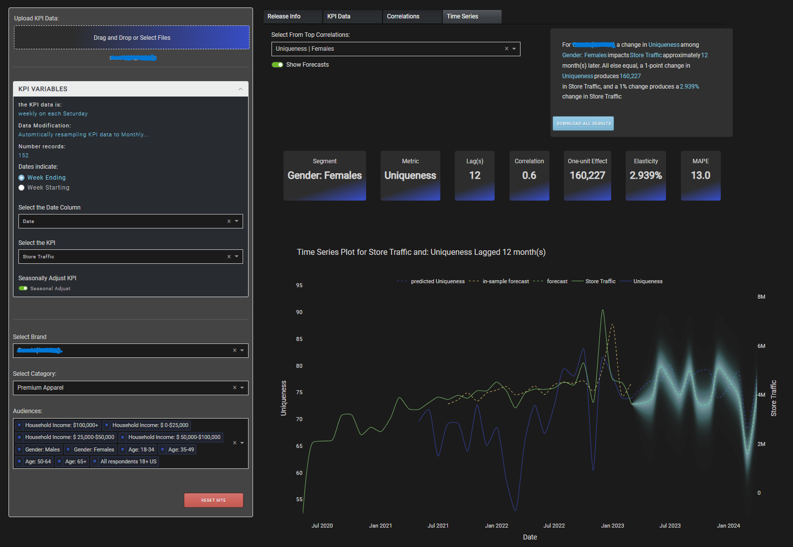
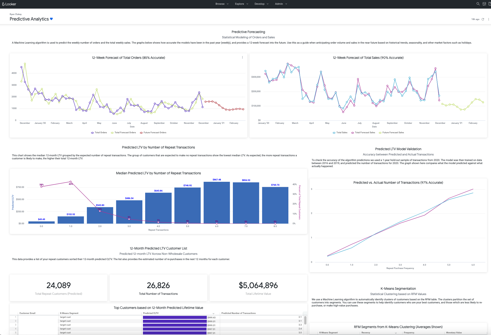
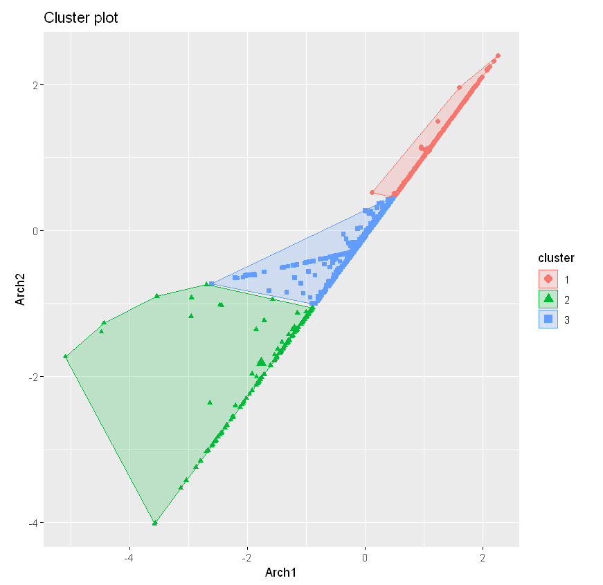
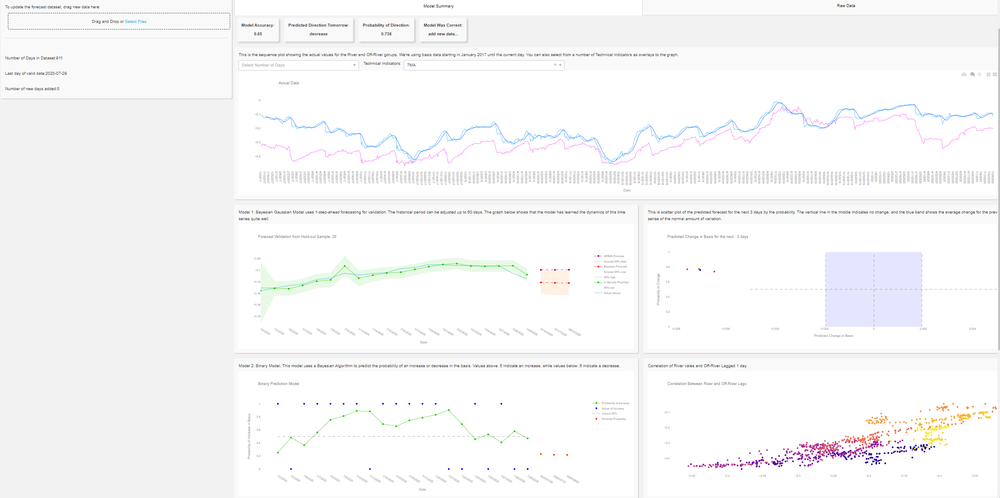
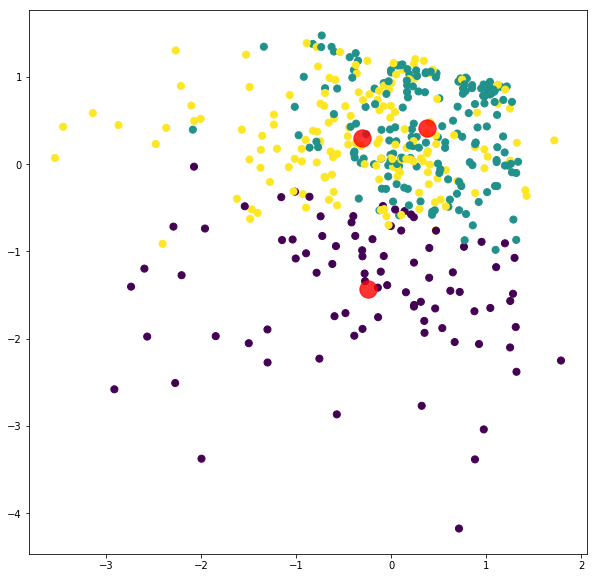

# Machine Learning Engineering Portfolio

This is a sample of data science projects using Python and R that cover a range of predictive modeling and exploratory analysis methods.  

### Table of Contents
[GenerativeAI and LLMs](#GenAI)  
[Time Series and Forecasting](#Time-Series)  
&emsp;[Bayesian Forecasting](#Bayesian-Time-Series-Forecasting)  
&emsp;[E-commerce Forecasting](#E-Commerce-Forecasting)  
[Deep Learning](#Deep-Learning)  
[Structural Equation Models](#Structural-Equation-Models)  
[Bayesian Belief Networks](#Bayesian-Belief-Networks)  

## GenAI 

## Time Series and Forecasting

### Bayesian Time Series Forecasting
> **Keywords:** Forecasting  |  Bayesian  |  Dynamic Linear Models  |  Dash  |  Plotly  
> [View Source](Forecasting/bayesian_forecast_dash_app.py) 

This application was built using Plotly Dash.  The application uses a Dynamlic Regression algorithm to predict a user-selected KPI (i.e. Sales) from a given Brand Equity metric. 
The API automatically checks for correlated lags up to 12 months, then returns the best Cross-Correlation structure to be used in subsequent multivariate forecasting.
The user is able to simulate changes to the predictor variables in real-time.  Manipulating the brand equity score value has will show the effect on the KPI forecast in real time. 

### E-Commerce Forecasting
[LTV and Forecasting](Python/LTV_Forecast_v2.ipynb)

### Generalized Low Rank Model for Mixed Data Clustering
This is an example of R Code which applies numerous statistical functions to prepare mixed Survey data for clustering
[GLRM](GLRM/GLRM_R_Segmentation.ipynb)

# Deep Learning

### LSTM Forecasting for Futures Commodity 
An example of using LSTM for time series / forecasting. 
[LSTM](Python/LSTM_NN_Forecasting.ipynb)

### Sample Dash App for Bayesian Forecasting
An example of a Python App deployed using Dash to AWS - integration with PostGres SQL Database and S3 Storage Bucket
[Dash App](Forecasting/bayesian_forecast_dash_app.py)

# Bayesian Belief Networks

# Structural Equation Models

## Record Matching / Entity Resolution
[Record Matching](Python/Record_matching.py)

## Exploratory Factor Analysis and Clustering

[EFA/Clustering Diabetes](Python/diabetes_data_reduction_clustering.ipynb)

## Random Forest 

[RandomForest in Python](Python/RandomForest.ipynb)

## Logistic Regression 
[Logistic Regression](Python/Logistic_Regression.ipynb)

# R
A collection of data science projects using R

## Shiny R Dashboard 
Created a Shiny (R) dashboard that intakes a raw .csv file and allows the user to select variables to perform multivariate forecasting using both ARIMA and Bayesian algorithms. 
[Multivariate Time Series](http://ryanclukey.shinyapps.io/MV_forecast)

