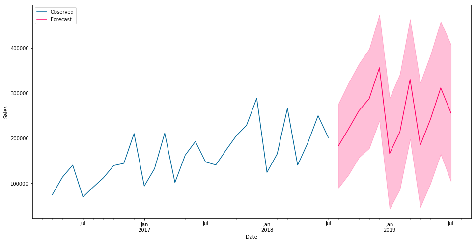

# Data Science and Statistical Analysis Projects

This is a sample of data science projects that have been conducted in various languages, including R, Python, and SPSS.  It is meant to provide a brief illustration of several concepts in applied statistical analysis and machine learning.  Where necessary, propriety data has been withheld or obscured.

# Python 
A collection of Data Science projects using Python

## Looker Dashboard for E-commerce Store
[LTV and Forecasting](LTV_Forecast_v2.ipynb)

## Record Matching / Entity Resolution
[Record Matching](Record_matching.py)

## Exploratory Factor Analysis and Clustering

[EFA/Clustering Diabetes](diabetes_data_reduction_clustering.ipynb)

## Random Forest 

[RandomForest in Python](RandomForest.ipynb)

## Logistic Regression 
[Logistic Regression](Logistic_Regression.ipynb)

# R
A collection of data science projects using R

## Shiny R Dashboard 
Created a Shiny (R) dashboard that intakes a raw .csv file and allows the user to select variables to perform multivariate forecasting using both ARIMA and Bayesian algorithms. 
[Multivariate Time Series](http://ryanclukey.shinyapps.io/MV_forecast)

## Generalized Low Rank Model for Mixed Data Clustering
This is an example of R Code which applies numerous statistical functions to prepare mixed Survey data for clustering
[GLRM](GLRM/GLRM_R_Segmentation.ipynb)

# Forecasting and Time Series 

## SARIMAX Python Time Series Forecasting
This is an example of using Seasonal ARIMAX (without exogenous predictors).  

[time_series](timeseries.ipynb)

      
## ARIMAX R
In this is similar to the previous analysis, however it was developed in R and is not a "seasonal" model.

[ARIMAX Example](ARIMAX.ipynb) 

## Bayesian Time Series R
[Bayesian Time Series](Bayesiantimeseries.ipynb)

