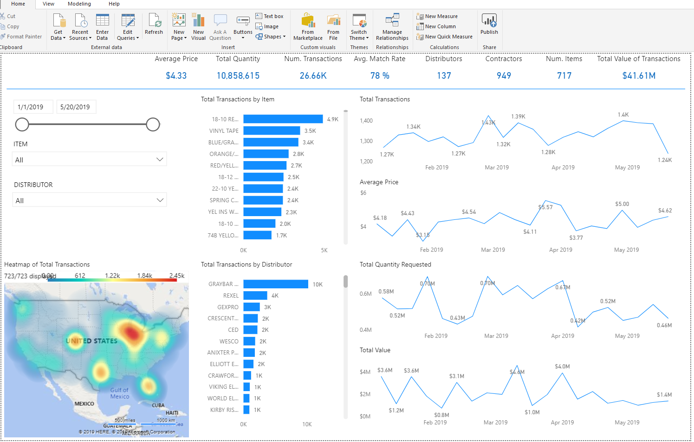
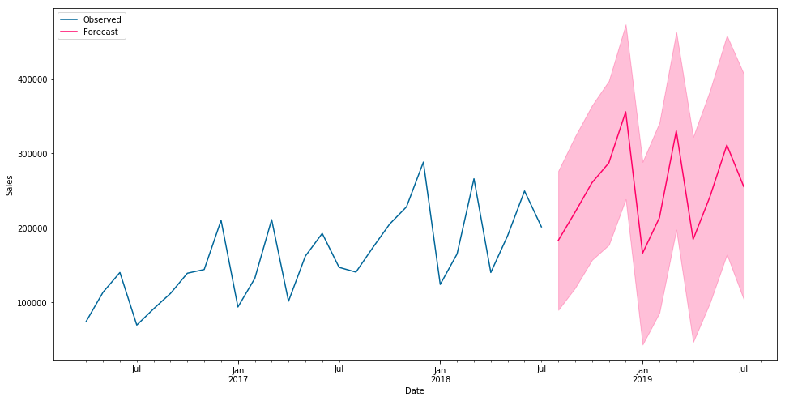

# Data Science and Statistical Analysis Projects

This is a sample of data science projects that have been conducted in various languages, including R, Python, and SPSS.  It is meant to provide a brief illustration of several concepts in applied statistical analysis and machine learning.  Where necessary, propriety data has been withheld or obscured.

# Shiny R Dashboard 
Created a Shiny (R) dashboard that intakes a raw .csv file and allows the user to select variables to perform multivariate forecasting using both ARIMA and Bayesian algorithms. 
[Multivariate Time Series](http://ryanclukey.shinyapps.io/MV_forecast)

# Tensorflow for Product Classification 
[Neural Network Classification](Tensorflow_Experiment.ipynb)

# PowerBI Dashboard

# SARIMAX Python Time Series Forecasting
This is an example of using Seasonal ARIMAX (without exogenous predictors).  

[time_series](timeseries.ipynb)

      

# Python Classification and Integration with SnowFlake 
[snowflake connection] 
[product classification](complete_500k_classification.ipynb) 

# ARIMAX R
In this is similar to the previous analysis, however it was developed in R and is not a "seasonal" model.

[ARIMAX Example](ARIMAX.ipynb) 

# Bayesian Time Series R
[Bayesian Time Series](Bayesiantimeseries.ipynb)

# Exploratory Factor Analysis and Clustering

[EFA/Clustering Diabetes](diabetes_data_reduction_clustering.ipynb)

# Random Forest 

[RandomForest in Python](RandomForest.ipynb)

# Logistic Regression 
[Logistic Regression](Logistic_Regression.ipynb)
